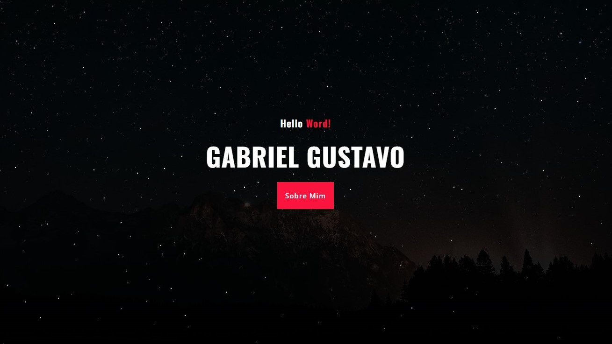

# Olá, Amantes da Ciência e da Tecnologia! 👋

### É realmente Incrível ter vocês aqui!

## Meus projetos

Sinta-se à vontade para explorar os meus projetos no GitHub!

Você também podem descobrir mais sobre mim ou sobre meus projetos, acessando [meu site.](https://gabrielgustavoms.github.io/GabrielGustavoMS/)

## Sobre mim:

### 5 Fatos sobre mim:

- 💻 Atualmente trabalho com desenvolvimento frontend e 🎵 produção musical ...
- 🤓 Estou cursando uma Pós Graduação Latu Sensu em Ciência de Dados ...
- 🎓 Sou formado em Ciências da Computação pela Universidade Cruzeiro do Sul ...
- 📙 Atualmente estou atualizando meus conhecimentos em JavaScript ...
- 🧐 Apesar do meu foco em frontend, já meu aventurei por diversas tecnologias ...

### Rede Sociais - Onde você pode me encontrar:

- 🔗 Linked-in: [Gabriel Gustavo](https://www.linkedin.com/in/gabrielgustavoms)
- 🌐 Site: [Garbriel Gustavo MS](https://gabrielgustavoms.github.io/GabrielGustavoMS/)
- ▶️ YouTube: [Gabri Gu](https://www.youtube.com/GabriGu?sub_confirmation=1)
- 📷 Instagram: [@gabriguto](https://www.instagram.com/gabriguto/)
- 📖 Facebook: [Gabri Gu](https://www.facebook.com/gabriguto)
