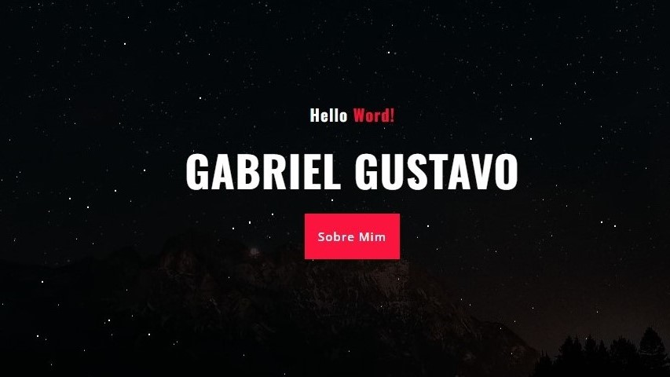

# Olá, Amantes da Ciência e da Tecnologia! 👋

### É realmente Incrível ter vocês aqui!

## Meus projetos

Sinta-se à vontade para explorar os meus projetos no GitHub!

Você também pode descobrir mais sobre mim ou sobre meus projetos, acessando [meu site.](https://gabrielgustavoms.github.io/GabrielGustavoMS/)

## Sobre mim:

### Alguns fatos sobre mim:

- 🤓 Sou Pós Graduado em Ciência de Dados ...
- 🎓 Sou formado em Ciências da Computação pela Universidade Cruzeiro do Sul ...
- 📙 Atualmente estou atualizando meus conhecimentos em JavaScript ...
- 🧐 Apesar do meu foco em frontend, já meu aventurei por diversas tecnologias ...

### Redes Sociais - Onde você pode me encontrar:

- 🔗 Linked-in: [Gabriel Gustavo](https://www.linkedin.com/in/gabrielgustavoms)
- 🌐 Site: [Gabriel Gustavo MS](https://gabrielgustavoms.github.io/GabrielGustavoMS/)
- ▶️ YouTube: [Gabri Gu](https://www.youtube.com/GabriGu?sub_confirmation=1)
- 📷 Instagram: [@gabriguto](https://www.instagram.com/gabriguto/)
- 📖 Facebook: [Gabri Gu](https://www.facebook.com/gabriguto)

## Principais Tecnologias

### Front-end:

<code></code> HTML &nbsp;&nbsp;
<code></code> CSS &nbsp;&nbsp;
<code></code> JavaScript &nbsp;&nbsp;
<code></code> JQuery &nbsp;&nbsp;
<code></code> Bootstrap

### Back-end:

<code></code> Java SE e Java EE &nbsp;&nbsp;
<code></code> Python &nbsp;&nbsp;
<code></code> PHP &nbsp;&nbsp;
<code></code> MySQL

### Mobile:

<code></code> Android Studio

### IDE's:

<code></code> Visual Studio Code &nbsp;&nbsp;
<code>  
</code> Netbeans

## Outras Tecnologias:

<code></code>&nbsp;&nbsp;
<code></code>&nbsp;&nbsp;
<code></code>&nbsp;&nbsp;
<code></code>&nbsp;&nbsp;
<code></code>&nbsp;&nbsp;
<code></code>&nbsp;&nbsp;
<code></code>&nbsp;&nbsp;
<code></code>&nbsp;&nbsp;
<code></code>&nbsp;&nbsp;
<code></code>&nbsp;&nbsp;
<code></code>&nbsp;&nbsp;
<code></code>&nbsp;&nbsp;

